# 🏸 Court Booking Platform

A full-stack **court booking platform** built using **Next.js, Prisma, and PostgreSQL**. The system supports **atomic multi-resource bookings** (court, equipment, coach), **rule-driven dynamic pricing**, and **admin-configurable resources**.

This project is designed with a **backend-first, system-design approach**, focusing on correctness under concurrency, clean data modeling, and separation of concerns.

---

## 🚀 Features

### 1. Multi‑Resource Atomic Booking

* Book **court + optional equipment + optional coach** in a single transaction
* All resources must be available for the selected time slot
* Booking is **atomic** — either all resources are reserved or none are
* Prevents double booking via database transactions

### 2. Dynamic, Rule‑Driven Pricing

Pricing is calculated dynamically based on **configurable rules**:

* Peak hours (6–9 PM)
* Weekends
* Indoor courts
* Coach fees
* Equipment rental fees

Rules **stack together** (e.g., indoor + peak + weekend).

Pricing logic is **data‑driven** — no hardcoded conditions.

### 3. Admin Configuration

Admin panel supports:

* Court management (add/edit/disable)
* Equipment inventory management
* Coach profiles & availability
* Pricing rules (create, enable/disable, update)

### 4. Frontend Booking Experience

* Built using **shadcn/ui** and **21.dev** component primitives
* Consistent design system with accessible, reusable UI components
* View available slots by date
* Select court, equipment, and coach
* Live price breakdown while selecting options
* Confirm booking
* View booking history

### 5. Bonus

* Concurrency-safe booking using database transactions
* Authentication using **Clerk** with role-based access control (USER / ADMIN)
* Waitlist support for fully booked court slots

---

## 🛠 Tech Stack

| Layer      | Technology                                                              |
| ---------- | ----------------------------------------------------------------------- |
| Frontend   | Next.js (App Router), React, Tailwind CSS, shadcn/ui, 21.dev components |
| Backend    | Next.js Route Handlers                                                  |
| Database   | PostgreSQL                                                              |
| ORM        | Prisma                                                                  |
| Validation | Zod                                                                     |
| Auth       | Clerk (User model is Clerk-ready)                                       |

-----|-----------|
| Frontend | Next.js (App Router), React, Tailwind CSS |
| Backend | Next.js Route Handlers |
| Database | PostgreSQL |
| ORM | Prisma (schema-first design) |
| Validation | Zod |
| Auth | Clerk (User model is Clerk-ready) |

---

## 📐 High‑Level Architecture

```
Client (Next.js)
   ↓
Server Components
   ↓
API Route Handlers
   ↓
Booking Engine & Pricing Engine
   ↓
Database (PostgreSQL)
```

## 🖼 Images

<h2>User Images</h2>
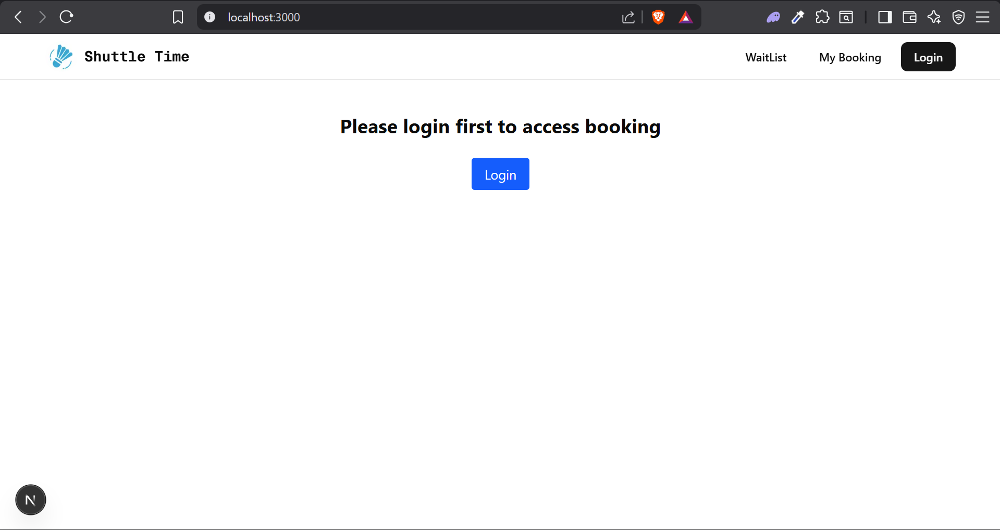
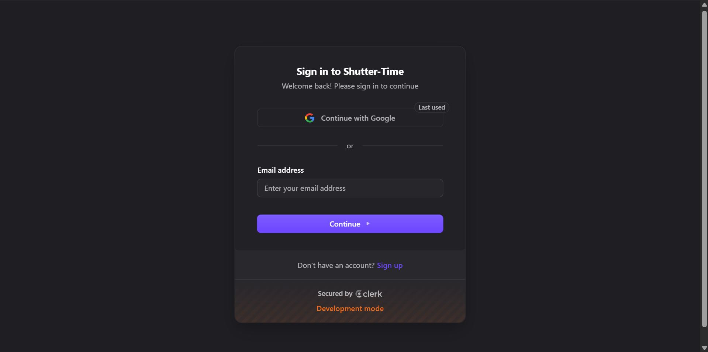
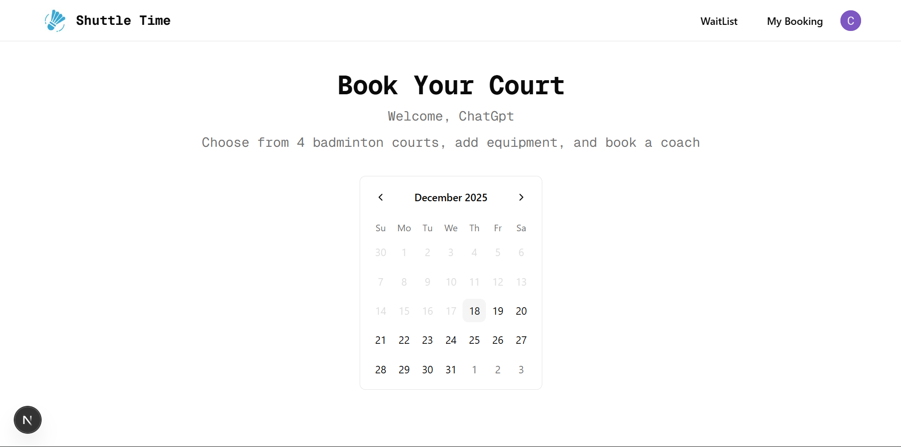
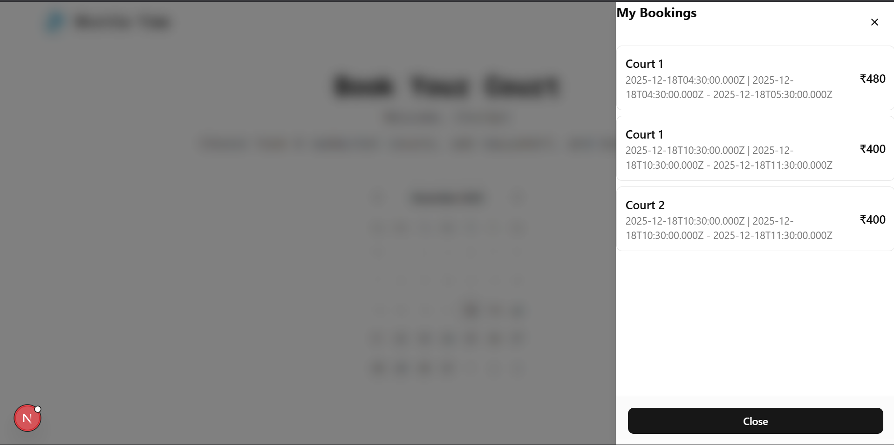
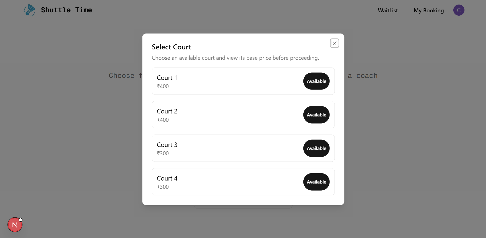
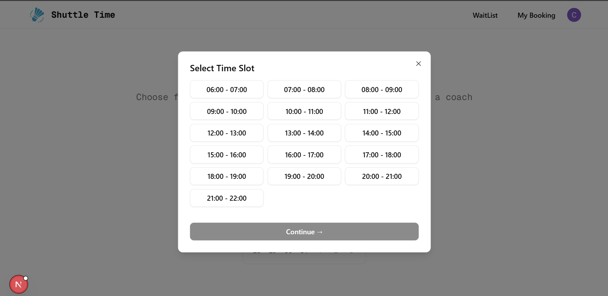
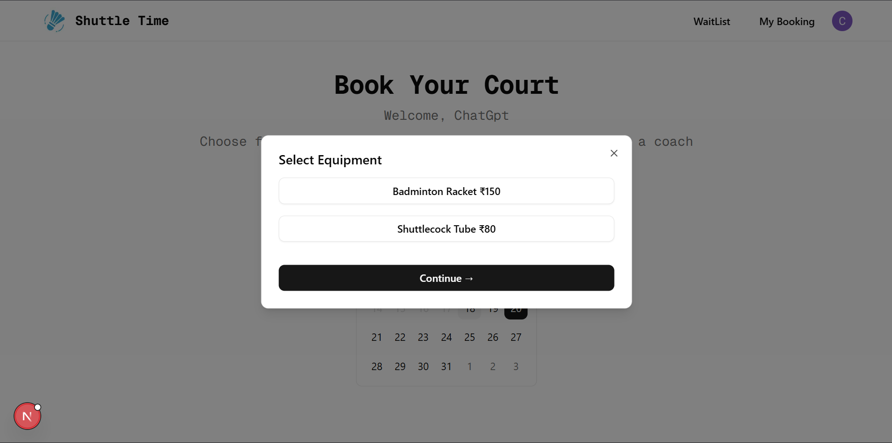
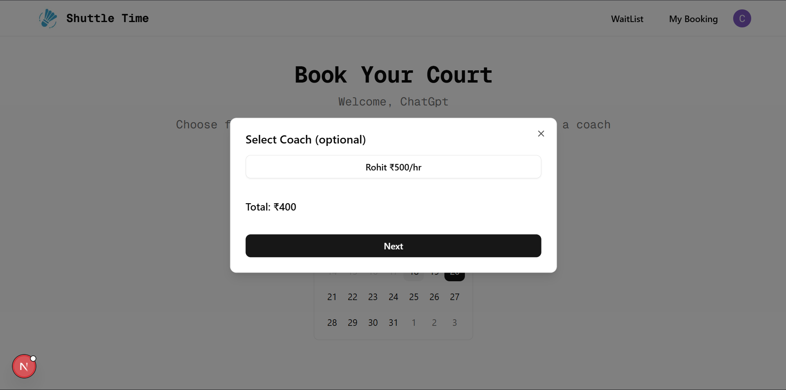
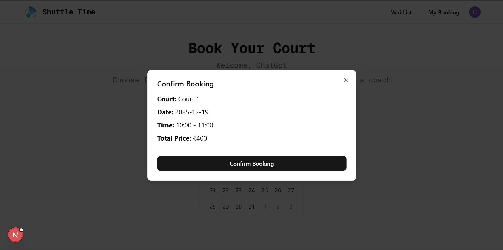
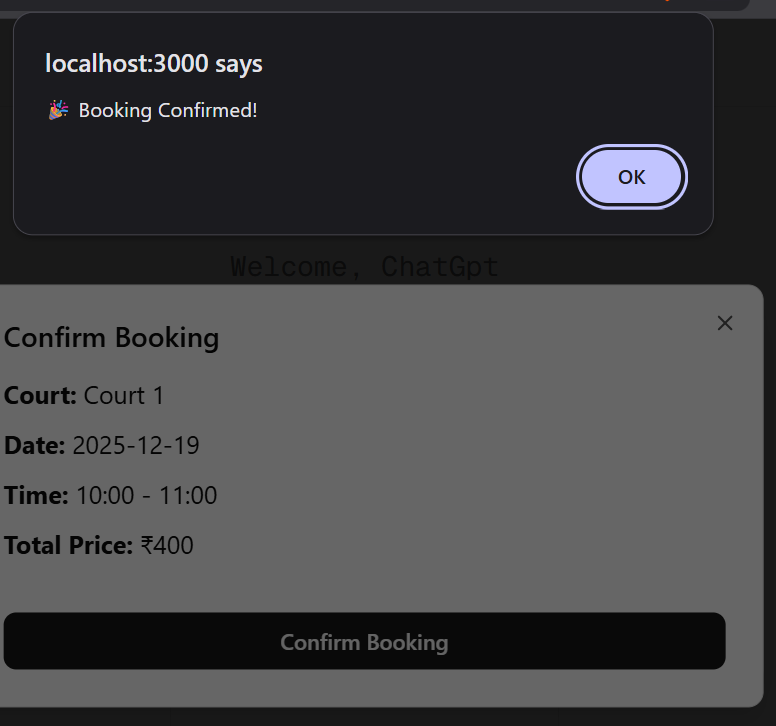

<h2>Admin Images</h2>
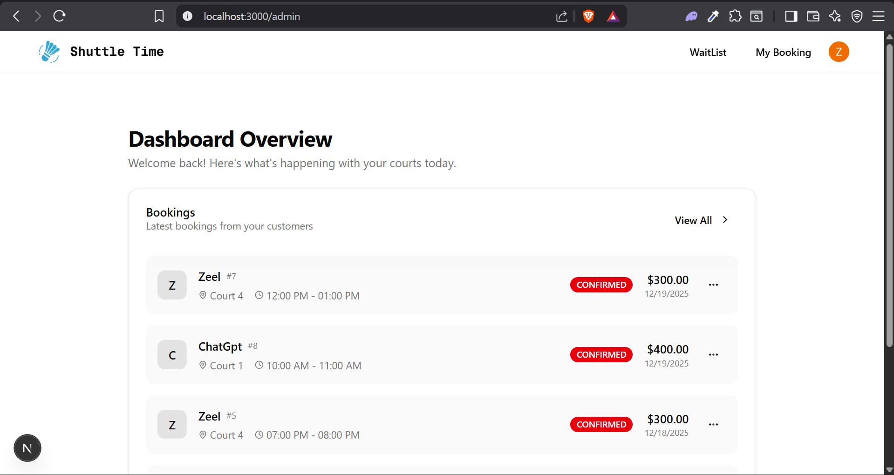
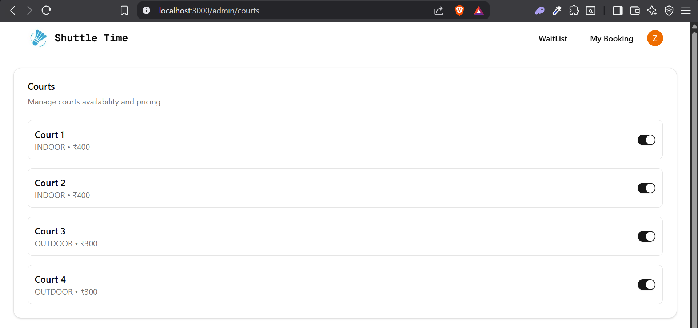
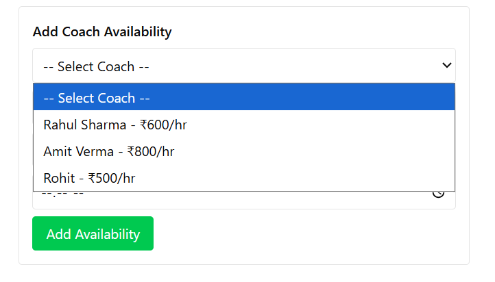

---

## 🧠 Core Design Principles

* **Time‑centric modeling** — availability is derived from bookings, not flags
* **Atomic transactions** for multi‑resource booking
* **Separation of concerns**:

  * Booking logic ≠ Pricing logic
  * Admin configuration ≠ Booking execution
* **Backend is the source of truth** — frontend is a consumer

---

## 🗄 Database Design Overview

### Prisma & Database Setup

This project uses **Prisma ORM with PostgreSQL** as the primary database layer.

* Prisma is used in a **schema-first approach**
* PostgreSQL acts as the single source of truth
* All relationships, constraints, and integrity rules are enforced at the database level

The Prisma client is generated into a custom output directory and used across server components and API route handlers.

```prisma
generator client {
  provider = "prisma-client-js"
  output   = "../src/generated/prisma"
}

datasource db {
  provider = "postgresql"
  url      = env("DATABASE_URL")
}
```

The schema is designed to support **transactional booking**, **time-based availability**, and **rule-driven pricing**.

---

## 🗄 Database Design Overview

The database is modeled using **Prisma + PostgreSQL** with a **booking-centric architecture**. A `Booking` acts as the aggregate root and owns all reservations made during a time slot.

### Core Models

* `User` – Clerk-authenticated users with role-based access
* `Booking` – Root entity representing a single booking transaction
* `Court` – Indoor/Outdoor courts with base pricing
* `Equipment` – Inventory-based rentable items
* `Coach` – Coaches with hourly pricing

### Reservation Models (Atomic Design)

Each booking may reserve multiple resources:

* `CourtReservation` (1:1 with Booking)
* `CoachReservation` (1:1 with Booking)
* `EquipmentReservation` (1:N with Booking)

All reservations are created inside a **single database transaction**, ensuring atomicity.

### Coach Availability

* Coach schedules are modeled explicitly via the `Availability` table
* Each availability slot can be booked at most once
* Coach bookings reference a specific availability slot, avoiding overlap complexity

### Pricing Rules

* Pricing behavior is driven by the `PricingRule` table
* Rules support flat or percentage-based adjustments
* Priority-based evaluation allows stacking (e.g. peak + weekend + indoor)

### Waitlist

* Users can join a waitlist for a **specific court and time window** when no slots are available
* Waitlist entries are time-bound (date, startTime, endTime)
* Users are authenticated via **Clerk** (user identity is never trusted from the client)
* Availability checks reuse the same **time-overlap logic** as bookings
* On booking cancellation, the next eligible waitlist entry can be promoted

Availability is determined by **overlapping bookings and reserved availability slots**, not static flags.

by **overlapping bookings and reserved availability slots**, not static flags.

---

## 🔒 Atomic Booking Flow

1. Client requests booking
2. Backend starts database transaction
3. Availability checked for:

   * Court
   * Coach
   * Equipment quantity
4. Pricing engine calculates final price
5. Booking + related resource rows created
6. Transaction commits

If any step fails → transaction rolls back.

---

## 💰 Pricing Engine Approach

Pricing is evaluated using a **rules engine** exposed via a dedicated **pricing preview endpoint**.

### Pricing Preview (`/api/pricing/preview`)

* Stateless endpoint used by the frontend to show **live price breakdowns**
* Uses the same pricing logic as booking to avoid mismatches
* Price is calculated based on:

  * Court base price × booking duration
  * Configurable pricing rules (peak hours, weekend, indoor)
  * Optional equipment fees
  * Optional coach fees (hourly × duration)

**Important implementation notes:**

* Court pricing is duration-based to match final booking price
* Peak hour rules are applied using **time overlap checks**, not just start time
* Pricing rules are evaluated in priority order
* Endpoint is read-only and never creates reservations

---

## 🔌 API Endpoints

### Public / User APIs

#### Availability

```http
GET /api/availability?date=&startTime=&endTime=
```

Returns available courts for the selected time slot.

#### Equipment Availability

```http
GET /api/equipment/availability?date=&startTime=&endTime=
```

Returns enabled equipment with remaining quantities for the selected slot.

#### Pricing Preview

```http
POST /api/pricing/preview
```

Returns a live price breakdown (court + pricing rules + equipment + coach) without creating a booking.

#### Booking

```http
POST /api/booking
```

Creates an atomic booking (court, equipment, coach) inside a database transaction.

#### User Bookings

```http
GET /api/booking?clerkId=
```

Returns booking history for the authenticated user.

---

### Admin APIs (Clerk Admin Role Required)

#### Coaches

```http
GET  /api/admin/coaches
POST /api/admin/coaches
```

* Create and list coaches
* Admin-controlled pricing per hour

#### Coach Availability

```http
POST /api/admin/coaches/:coachId/availability
```

* Create explicit availability slots for coaches
* Availability is time-bound and booked atomically during booking

#### Courts

```http
GET   /api/admin/courts
POST  /api/admin/courts
PUT   /api/admin/courts
PATCH /api/admin/courts
```

* Create, update, enable, or disable courts
* Indoor / Outdoor court types supported

#### Waitlist

```http
POST /api/waitlist/join
```

* Allows users to join a waitlist for fully booked slots
* Promotes fairness via FIFO queueing

---

## 🌱 Seed Data

Seed script initializes:

* 4 Courts (2 Indoor, 2 Outdoor)
* 3 Coaches with availability
* Equipment inventory (rackets, shoes)
* Pricing rules (peak, weekend, indoor, coach, equipment)

---

## 🧪 Running the Project

```bash
# install dependencies
npm install

# setup database
npx prisma migrate dev
npx prisma db seed

# run dev server
npm run dev
```

---

## 📝 Assumptions

* Time slots are continuous (not fixed blocks)
* One booking owns all selected resources
* Pricing rules are evaluated sequentially
* Admin users manage configuration manually

---

## 📌 Future Improvements

Planned enhancements to make the platform production‑ready and more user‑friendly:

1. **Admin Notifications**

   * Notify admins on new bookings, cancellations, and waitlist promotions (email / dashboard alerts).

2. **Enhanced Waitlist System**

   * Automatic promotion from waitlist on cancellation.
   * Real‑time notifications to users when a slot becomes available.

3. **Payment Integration**

   * Integrate a payment gateway (Stripe / Razorpay).
   * Support partial payments, refunds, and booking cancellation policies.

4. **Admin Equipment Management UI**

   * Dedicated admin components to add, edit, enable/disable equipment.
   * Inventory tracking and low‑stock alerts.

5. **Real‑Time Court Feed**

   * Live status updates from courts (occupied / free / delayed).
   * Possible integration with IoT devices or manual admin toggles.

6. **WhatsApp Booking & Notifications**

   * Allow users to book courts via WhatsApp chatbot.
   * Send booking confirmations, reminders, and cancellations on WhatsApp.

---

## 📄 Short Write‑Up Summary

This system models bookings as **atomic state transitions across time‑bound resources**. Availability is derived from existing bookings rather than stored explicitly, preventing inconsistencies. Pricing is handled through a modular, rule‑driven engine that allows dynamic changes without code modification. Database transactions ensure correctness under concurrency, and clean separation between booking, pricing, and configuration logic keeps the system scalable and maintainable.

---

## 👤 Author

Built as a system‑design–focused project to demonstrate backend architecture, transactional safety, and clean API design.
